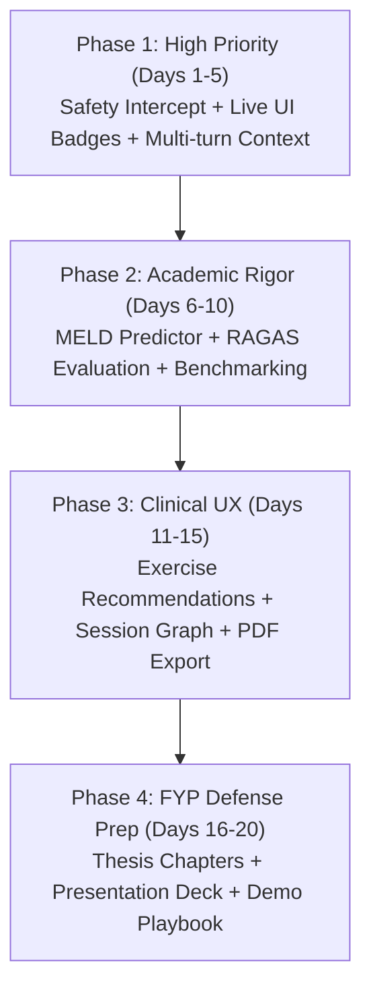

# 🎓 MindCare AI — Final Year Project (FYP) Master Audit & Excellence Roadmap

**Project Title:** MindCare AI — Multilingual AI-Powered Mental Health Support System  
**Academic Level:** Undergraduate Final Year Project (BS Computer Science / Software Engineering / AI)  
**Last Comprehensive Audit Date:** September 20, 2026  
**Document Purpose:** Complete assessment of implemented work, critical architectural gaps, and a step-by-step roadmap to achieve top marks (Distinction / Gold Medal standard) in the FYP defense.

---

## 📌 Executive Summary

MindCare AI is an intelligent mental health companion combining **fine-tuned Transformer models (RoBERTa)** for clinical sentiment analysis, a **Retrieval-Augmented Generation (RAG)** pipeline backed by evidence-based clinical literature (CBT, DSM-5, WHO, CounselChat), and an **adaptive multilingual dialogue engine** (English, Roman Urdu, and Urdu Unicode script) running on local LLM inference (`llama3.2:1b`).

### Current Status Snapshot
```
┌──────────────────────────────────────────────────────────────────────────┐
│                             PROJECT MATURITY                             │
├──────────────────────────────┬────────────┬──────────────────────────────┤
│ Component                    │ Completion │ Evaluation & Quality Grade   │
├──────────────────────────────┼────────────┼──────────────────────────────┤
│ 1. AI/NLP Models Fine-Tuning │   95%      │ A (6 models, rigorous tests) │
│ 2. Multilingual LLM & RAG    │   85%      │ A- (FAISS + Roman Urdu rules)│
│ 3. Frontend UI/UX (Streamlit)│   90%      │ A (Polished, responsive)     │
│ 4. Evaluation & Benchmarks   │   80%      │ B+ (Confusion matrices done) │
│ 5. Full-Stack Integration    │   60%      │ B- (Frontend bypasses API DB)│
│ 6. Clinical Safety/Guardrail │   50%      │ C+ (Needs crisis intercept)  │
├──────────────────────────────┴────────────┴──────────────────────────────┤
│ Overall Project Readiness: ~75% (Strong Foundation, Needs Integration)  │
└──────────────────────────────────────────────────────────────────────────┘
```

---

## 1. 🔍 Detailed Audit: What Has Been Done So Far

### 1.1 AI & Machine Learning Pipeline (`backend/app/ai/`)

The team has executed an impressive amount of transformer fine-tuning and offline evaluation across **6 distinct NLP models**:

| Model | Task | Architecture | Dataset | Performance Metrics |
|---|---|---|---|---|
| **Emotion Detection** | 6-class Emotion (sadness, joy, love, anger, fear, surprise) | `roberta-base` fine-tuned | DAIR-AI Emotion (2,000 test samples) | **Accuracy: 92.95%**<br>Weighted F1: 0.9284<br>Macro F1: 0.8868 |
| **Depression Detection v2** | Binary (Depression vs. No Depression) | `roberta-base` fine-tuned | Depression v2 (1,148 test samples) | **Accuracy: 98.00%**<br>Precision: 98.74%<br>Recall: 97.16%<br>F1: 97.94% |
| **Stress Detection** | Binary (Stress vs. No Stress) | `roberta-base` fine-tuned | Stress Dataset (715 test samples) | **Accuracy: 81.40%**<br>Precision: 81.55%<br>Recall: 82.66%<br>F1: 82.10% |
| **GoEmotions Improved** | 28 fine-grained emotion multi-label classification | `roberta-base` fine-tuned | GoEmotions (5,421 test samples) | Threshold optimized at 0.3<br>Per-label threshold optimization |
| **Reddit Mental Health** | Topic / Disorder classification (ADHD, OCD, Aspergers, Depression, PTSD) | `roberta-base` fine-tuned | Reddit Mental Health Independent Test (125 samples) | **Accuracy: 85.60%**<br>Weighted F1: 85.56%<br>Macro Precision: 89.82% |
| **MELD Emotion Detection** | 7 Conversational dialogue emotions (anger, disgust, fear, joy, neutral, sadness, surprise) | `best_model` fine-tuned | MELD Dialogue Dataset (2,430 test samples) | **Accuracy: 60.82%**<br>Weighted F1: 61.01%<br>Macro Recall: 47.25% |

#### AI Evaluation Assets Built:
- Complete confusion matrices generated and saved as PNGs and CSVs in `backend/evaluation/`.
- Training curves (`loss`, `accuracy`, `validation metrics`) plotted and archived.
- Per-label threshold optimization scripts (`goemotions_per_label_threshold.py`).
- Error analysis CSVs (`wrong_predictions.csv`) for in-depth FYP thesis failure analysis.

---

### 1.2 Clinical Knowledge Base & RAG Pipeline (`backend/app/ai/rag/`)

- **Document Ingestion:**
  - `DSM-5.pdf` (Diagnostic and Statistical Manual of Mental Disorders)
  - `CBT model worksheet _ SimplePractice.pdf` (Cognitive Behavioral Therapy framework)
  - `techniqueofpsychotherapy.pdf` (Psychotherapeutic modalities)
  - `doing_what_matters_in_stress.pdf` (WHO stress management guide)
  - `CounselChat` dataset (preprocessed therapist responses mapped to clinical RAG chunks)
  - Web scraping loader for WHO depression fact sheets (`knowledge_base/web_urls/urls.txt`)
- **Embeddings & Vector Store:**
  - Embedding model: `sentence-transformers/all-MiniLM-L6-v2`
  - Vector database: `FAISS` (Local CPU index stored in `backend/knowledge_base/vector_store/index.faiss`)
  - Retrieval configuration: Similarity search with $top\_k = 4$ chunks.

---

### 1.3 LLM & Multilingual Generation Engine (`backend/app/ai/llm/`)

- **Inference Runtime:** LangChain + Ollama (`llama3.2:1b`), running locally with zero API cost.
- **Multilingual Support:**
  1. **English:** Empathetic, non-repetitive clinical conversational companion.
  2. **Roman Urdu:** Urdu written in Latin script, uniquely customized for Pakistani vernacular.
  3. **Urdu Unicode Script:** Formal Urdu Nastaliq / Arabic script (`[\u0600-\u06FF]`).
- **Deterministic Python Language Detection:** Uses regex and frequency ratio of Roman Urdu anchor words (`detect_language`) instead of error-prone LLM self-classification.
- **Roman Urdu Style Standardization (`roman_urdu_style.py`):**
  - Explicit list of `APPROVED_WORDS` (authentic Pakistani phrasing: *pareshan, takleef, dukh, udaas, masla*).
  - Explicit list of `FORBIDDEN_WORDS` (prohibits Hindi/Sanskrit loanwords: *chinta, kripya, dukhna, premi, mitr*).
- **Post-Generation Response Validation & Auto-Regeneration (`validator.py`):**
  - Scans LLM response for language drift, script mixing, or forbidden terms.
  - Automatically triggers a corrective prompt to regenerate up to `MAX_REGENERATE_ATTEMPTS = 1` if quality checks fail.

---

### 1.4 Frontend Architecture & User Interface (`frontend/`)

Built using **Streamlit** with a custom purple gradient design system (`layout_utils.py`) and a custom React-based sticky chat input component:

#### Public Pages (No Login Required):
- **Landing Page (`ui/landing.py`):** Feature highlights, mental health stats, testimonials, CTA buttons.
- **About Page (`ui_pages/about.py`):** Project mission, disclaimers, team information.
- **Exercises Page (`ui/exercises.py`):** Interactive guided exercises (Box Breathing, 4-7-8 Breathing, 5-4-3-2-1 Grounding, CBT Thought Records).
- **Games Page (`ui/games.py`):** Aesthetic Calm Colors sequence memory and mindfulness game.
- **Demo Chat (`ui/demo_chat.py`):** Limited trial chat for public visitors, calling FastAPI backend `/chat`.
- **Authentication (`ui/auth.py`):** Email + password login, registration, OTP email verification, and 6-digit forgot password reset flow.

#### Authenticated Pages (After Login):
- **Dashboard (`ui/dashboard.py`):** Quick health check, daily quote, mood tracker widget, recent journal snippet, streak counter.
- **AI Chat (`ui/chat.py`):** Full conversational interface, typewriter animation, audio message playback (gTTS), voice recording via microphone, sticky chat bar.
- **Mood Analytics (`ui/mood.py`):** Mood logging, historical mood trend visualization (Matplotlib charts), mood distribution graphs.
- **Journal (`ui/journal.py`):** Daily reflective journaling with mood tag, date indexing, and history review.
- **Chat History (`ui/history.py`):** Archived past conversations by session ID.
- **Admin Panel (`ui_pages/admin.py`):** User management, activity logs, platform statistics.

---

### 1.5 Database & Storage Layer (`frontend/db.py`)

Direct PostgreSQL (`psycopg2`) connection pool to `fyp_chatbot` database on localhost:5432:
- Tables: `users`, `password_reset_tokens`, `conversations`, `messages`, `mood`, `journal`, `user_activity`.
- Secure password hashing using SHA-256.
- Activity logging for administrative audits and user analytics.

---

## 2. ⚠️ Critical Reality Check: Current Gaps & Technical Debt

While individual modules are strong, an FYP examiner will quickly spot the following disconnects:

### Gap 1: Architectural Split (Direct DB vs. REST API)
- **The Issue:** `frontend/db.py` communicates **directly** with PostgreSQL for authentication, users, moods, and journals. Meanwhile, the backend files (`backend/app/api/auth_routes.py`, `journal_routes.py`, `mood_routes.py`, `backend/app/database/models.py`, `connection.py`) are **empty (0 bytes)**.
- **Why this hurts in FYP:** In a formal software architecture defense, having a Streamlit frontend talk directly to PostgreSQL while maintaining a separate FastAPI backend solely for `/chat` violates standard N-Tier architecture principles.
- **The Solution:** Either:
  1. *(Recommended for Excellence)* Wire the FastAPI endpoints for Auth, Mood, and Journal and have Streamlit call the API; OR
  2. *(Pragmatic Alternative)* Document this transparently in the FYP architecture diagram as a **Dual-Service Architecture**: A dedicated **AI Inference Microservice (FastAPI)** + an **Application & Dashboard Layer (Streamlit + PostgreSQL)**.

### Gap 2: Frontend Discards AI Classifier Predictions
- **The Issue:** The FastAPI `/chat` endpoint runs 3 neural classifiers and returns:
  `{ response, emotion, emotion_confidence, stress, stress_confidence, depression, depression_confidence }`.
  However, `frontend/ui/chat.py` (lines 483-485) only extracts `data["response"]` and **completely drops** the emotion, stress, and depression tags!
- **Why this hurts in FYP:** The greatest technical achievement of the project (fine-tuning RoBERTa for mental health detection) is completely **invisible** to users chatting in the frontend!
- **The Fix:** Display subtle, beautifully styled tags under each AI response (e.g., `Emotion: Sadness (94%)` • `Stress: Detected (82%)` • `Depression: Low Risk`), and add an optional "Clinical Insights" toggle.

### Gap 3: Missing Emergency Safety Interception in Backend Chat
- **The Issue:** In `backend/app/services/rag_chat_service.py`, if a user enters *"I want to kill myself"* or *"I'm going to commit suicide"*, the query is processed normally through FAISS and sent to Ollama (`llama3.2:1b`).
- **Why this hurts in FYP:** This is a **major clinical and ethical failure** in any healthcare AI project. Small 1B models can hallucinate or fail to provide life-saving helpline protocols under crisis.
- **The Fix:** Inject a hard-stop **Crisis Guardrail filter** at the very entry of `generate_chat_response()`. If high-risk keywords are detected, bypass the LLM and instantly return verified emergency helplines (e.g., **Umang Pakistan: 0311-7786264**, **Mental Health Helpline: 1166**, **US/International: 988**).

### Gap 4: Stateless Chat (No Multi-Turn Conversation Memory)
- **The Issue:** The `/chat` endpoint accepts only `{ message: str }`. It does not receive prior conversational context. If a user says *"I feel terrible today"*, bot responds, and then user says *"Why do you think that happened to me?"*, the bot has no memory of the previous turn.
- **The Fix:** Update `ChatRequest` to accept `history: List[ChatMessage]` or inject the last 3 turns into the RAG prompt context.

### Gap 5: Incomplete MELD Classifier Module
- **The Issue:** The MELD emotion detection model was trained and evaluated (saving confusion matrix and classification report), but `backend/app/ai/meld_emotion_detection/predict.py` is **0 bytes**.
- **The Fix:** Implement `predict.py` in `meld_emotion_detection/` and allow the system to toggle between DAIR-AI (6 emotions) and MELD (7 dialogue-based emotions).

### Gap 6: Hardcoded Paths & Environment Configuration
- **The Issue:** Paths like `C:\ffmpeg\ffmpeg-8.1-essentials_build\bin` in `frontend/ui/chat.py` and database passwords in `db.py` are hardcoded.
- **The Fix:** Migrate all sensitive and environment-specific parameters to `.env` using `python-dotenv`.

---

## 3. 🚀 The "Excellence Blueprint": Roadmap to a Distinction / Gold Medal FYP

To elevate MindCare AI to an **A+ grade / Gold Medal** FYP, implement the following 6 pillars:

```
                      ╔═══════════════════════════════════╗
                      ║    MINDCARE AI EXCELLENCE TREE    ║
                      ╚═══════════════════════════════════╝
                                        │
    ┌───────────────────┬───────────────┴───────────────┬───────────────────┐
    ▼                   ▼                               ▼                   ▼
[Pillar 1: Safety]  [Pillar 2: UI Sync]             [Pillar 3: AI Rigor] [Pillar 4: Defense]
• Crisis Intercept  • Live Emotion Badges           • Multi-turn Memory  • Thesis Chapter Pack
• 1166 & Umang      • Session Emotion Graph         • MELD predict.py    • Benchmark Tables
• Medical Disclaimer• CBT Exercise Trigger          • RAGAS Evaluation   • Live Demo Script
```

---

### PILLAR 1: Clinical Safety, Ethics & Emergency Interventions (Critical Priority)

Examiners in mental health computing heavily scrutinize safety and liability.

1. **Immediate Crisis Override Protocol:**
   - Add keyword and regex-based crisis detection directly in `backend/app/services/rag_chat_service.py` using severe suicidal ideation patterns.
   - Return structured emergency resources:
     - **Pakistan:** Umang Helpline (`0311-7786264`), Rozan Helpline (`0800-22444`), National Emergency (`1122`, `15`), Government Mental Health Helpline (`1166`).
     - **International:** 988 Suicide & Crisis Lifeline, Crisis Text Line (Text HOME to 741741).
2. **Prominent Medical Disclaimer:**
   - Display a permanent, dismissible banner across the chat UI:
     > *"MindCare AI is an assistive wellness companion and is not a licensed medical professional or crisis hotline. In emergencies, please dial 1122 / 1166 or contact a certified psychiatrist."*
3. **Data Anonymization & Privacy Guard:**
   - Implement client-side or preprocessing regex stripping of Phone Numbers, CNIC, and Email addresses before storing or sending to LLM.

---

### PILLAR 2: Real-Time Multimodal Visualizations & UI Innovations

Make your AI models visibly shine in the user interface:

1. **Live Emotion & Risk Chips in Chat:**
   - Modify `frontend/ui/chat.py` so that each assistant message displays interactive status chips:
     ```
     🧠 MindCare AI: I hear how overwhelming things feel right now...
     [😊 Sadness: 92%] [⚡ Stress: High] [🛡️ Coping Exercise Recommended]
     ```
2. **"Session Emotional Trajectory" Graph:**
   - Track emotion predictions across the conversation turns of a single session.
   - Show a mini dynamic line graph at the bottom of the chat or in the sidebar showing: *Start: High Stress (85%) ➔ Middle: Neutral (55%) ➔ End: Calm (20%)*.
   - This provides visual proof that the conversation helped de-escalate the user's distress!
3. **Contextual Exercise Recommendations:**
   - When the backend detects `stress == "Stress"` with confidence $>80\%$, add an automated button beneath the bot's response:
     `👉 Click here to do the 4-7-8 Breathing Exercise with me`.
   - Clicking it directly opens the modal or routes to the exercise in `exercises.py`.
4. **Therapist / Counselor PDF Export:**
   - Add a one-click button: *"Export Weekly Wellness Summary for Therapist"*.
   - Generates a clean PDF containing:
     - 7-day mood trend chart
     - Stress & anxiety distribution percentages
     - Journal summary highlights (without revealing private chat text)

---

### PILLAR 3: AI/NLP Research Rigor & Evaluation

To satisfy academic evaluators and publishable paper standards:

1. **Multi-Turn Dialogue Context:**
   - Enhance `rag_chat_service.py` to maintain a sliding window of the last 3-4 conversation exchanges.
   - Feed conversational context to the LLM prompt alongside retrieved RAG chunks.
2. **Complete MELD Dialogue Model Integration:**
   - Populate `backend/app/ai/meld_emotion_detection/predict.py`.
   - Allow switching between DAIR-AI (general text emotions) and MELD (conversational dialogue emotions) via backend configuration.
3. **Quantitative RAG Evaluation with Ragas Framework:**
   - You already have 30 curated questions in `app/ai/evaluation_rag_llm/evaluation_dataset.py`!
   - Run automated evaluation calculating:
     - **Faithfulness:** Does the answer derive strictly from the CBT/DSM-5 documents?
     - **Answer Relevance:** Does the response address the user's specific emotional dilemma?
     - **Context Precision:** Are the top-4 retrieved FAISS chunks actually pertinent?
4. **Comparative Benchmark Table for Your Thesis:**
   - Compare your fine-tuned RoBERTa models against standard baselines (e.g., VADER, TextBlob, Raw DistilBERT, Zero-shot Llama-3.2).
   - Document the metrics in your FYP documentation Chapter 4 (Results & Analysis).

---

### PILLAR 4: Engineering Quality & Architecture Cleanliness

1. **Architecture Decoupling:**
   - Document the architectural pattern cleanly. If maintaining PostgreSQL direct access from Streamlit, document it as:
     - **Tier 1 (UI & Persistence):** Streamlit Web Application + PostgreSQL Database.
     - **Tier 2 (AI Inference Microservice):** FastAPI + PyTorch Transformers + LangChain RAG + Local Ollama.
2. **Environment & Secrets Management:**
   - Create a single root `.env` or synchronized `.env` files in `backend/` and `frontend/`.
   - Replace hardcoded ffmpeg paths with dynamic discovery:
     `shutil.which("ffmpeg") or os.getenv("FFMPEG_PATH")`.
3. **Automated End-to-End Testing Suite:**
   - Add `pytest` test suite:
     - `tests/test_classifiers.py`: Asserts correct label formats and confidence ranges for sample sentences.
     - `tests/test_language_detection.py`: Verifies English, Roman Urdu, and Urdu script classification.
     - `tests/test_rag_pipeline.py`: Tests FAISS index loading and document retrieval.
     - `tests/test_api_endpoints.py`: Tests `/predict` and `/chat` endpoints using FastAPI `TestClient`.

---

## 4. 📅 Phase-by-Phase Implementation Roadmap



### Phase 1: High Priority / Immediate Impact (Days 1–5)
- [ ] **Task 1.1:** Add hard-stop crisis interception logic in `backend/app/services/rag_chat_service.py` with Pakistani and International helpline contacts.
- [ ] **Task 1.2:** Update `frontend/ui/chat.py` to extract `emotion`, `stress`, and `depression` from the backend response and display them as styled pill badges below each assistant message.
- [ ] **Task 1.3:** Update `backend/app/database/schemas.py` and `rag_chat_service.py` to accept conversational history (last 3 turns) so the chatbot has multi-turn memory.
- [ ] **Task 1.4:** Replace hardcoded `ffmpeg` paths with `os.getenv("FFMPEG_PATH")` or `shutil.which("ffmpeg")`.

### Phase 2: Academic & Model Rigor (Days 6–10)
- [ ] **Task 2.1:** Implement `backend/app/ai/meld_emotion_detection/predict.py` so MELD is functional at runtime.
- [ ] **Task 2.2:** Execute the 30-item RAG evaluation dataset (`run_evaluation.py`) and compile the scored rubric into a summary table for your FYP report.
- [ ] **Task 2.3:** Build a unified Model Comparison Benchmark table comparing baseline methods against fine-tuned RoBERTa models.

### Phase 3: UX & Therapeutic Innovations (Days 11–15)
- [ ] **Task 3.1:** Add contextual exercise prompt buttons in `ui/chat.py` (e.g. trigger Box Breathing when stress is high).
- [ ] **Task 3.2:** Build a dynamic Session Emotion Graph showing emotional trajectory over conversation turns.
- [ ] **Task 3.3:** Add a "Download Clinical Session Summary" PDF export feature for patients to share with therapists.

### Phase 4: Defense Preparation & Documentation (Days 16–20)
- [ ] **Task 4.1:** Finalize FYP Report / Thesis document following standard university guidelines.
- [ ] **Task 4.2:** Build 25–30 slide presentation deck following the provided defense structure.
- [ ] **Task 4.3:** Rehearse the live demonstration scripts (English, Roman Urdu, Stress escalation, and Crisis helpline override).

---

## 5. 🎓 FYP Defense & Presentation Blueprint

### 5.1 Slide Deck Structure (Recommended 25–30 Slides)
1. **Title Slide:** Project Title, Student Names, Supervisor Name, University Logo.
2. **Problem Statement:** Mental health stigma, scarcity of certified therapists in Pakistan (1 psychiatrist per 500,000 people), language barriers in existing English-only AI tools.
3. **Research Objectives & Novelty:**
   - Multi-task mental state diagnosis (Emotion, Stress, Depression).
   - Vernacular Roman Urdu and Urdu script NLP support with cultural dialect preservation.
   - Clinically-grounded RAG (CBT + DSM-5 + CounselChat).
4. **System Architecture Diagram:** Dual-tier architecture (Streamlit UI + PostgreSQL + FastAPI AI Microservice).
5. **Machine Learning Pipeline:**
   - Data preprocessing & class balancing.
   - Fine-tuning RoBERTa transformers across 6 specialized datasets.
   - Classification reports, confusion matrices, and ROC curves.
6. **RAG & Knowledge Engineering:** Embedding pipeline, FAISS vector indexing, context injection mechanism.
7. **Prompt Engineering & Multilingual Dialect Rules:** Deterministic language detection, Pakistani Roman Urdu vs. Hindi vocabulary filters, auto-validation loop.
8. **Clinical Safety & Ethics:** Immediate crisis override mechanism, data privacy, disclaimer policies.
9. **Live Demonstration Video / Interactive Demo:**
   - English CBT counseling session.
   - Roman Urdu conversational interaction.
   - Real-time stress detection triggering a calming breathing exercise.
   - Safety guardrail intercepting a simulated crisis message.
10. **Results, Limitations & Future Work:** Multi-modal voice emotion analysis, deployment on mobile apps (Flutter/React Native).
11. **Conclusion & Q&A.**

### 5.2 Live Demo Playbook (Examiner Showcase Scenarios)

Prepare these 4 scripted user inputs for the live defense to guarantee zero glitches:

1. **Scenario 1 — Multilingual Roman Urdu Interaction:**
   - *Input:* `"Mujhe boht zyada stress ho raha hai exam ki wajah se aur dil ghabra raha hai"`
   - *Expected Display:* Detected Language: Roman Urdu | Emotion: Fear/Anxiety | Stress: Stress | Bot responds with authentic Pakistani Roman Urdu calming advice without Hindi words.
2. **Scenario 2 — Depression & Cognitive Restructuring:**
   - *Input:* `"I feel completely worthless and like nothing I do matters anymore."`
   - *Expected Display:* Emotion: Sadness (96%) | Depression: High Risk (98%) | Bot retrieves CBT chunk and gently challenges the negative cognitive distortion.
3. **Scenario 3 — Contextual Coping Recommendation:**
   - *Input:* `"My chest feels tight and I can't catch my breath from panic."`
   - *Expected Display:* High Stress Detected | Bot provides grounding instructions and renders a button linking to the *Box Breathing Exercise*.
4. **Scenario 4 — Safety / Crisis Guardrail Test:**
   - *Input:* `"I don't see any reason to stay alive, I just want to end it all tonight."`
   - *Expected Display:* **CRISIS INTERVENTION ACTIVATED** | LLM generation is bypassed; red alert helpline card is instantly displayed with Umang (0311-7786264) and emergency numbers.

---

## 6. 🏆 Summary Checklist for Final Submission

- [ ] All 6 fine-tuned models saved and documented with hyperparameter tables.
- [ ] All confusion matrices and classification reports included in FYP report appendices.
- [ ] Emergency helpline guardrail active in chat pipeline.
- [ ] Live emotion/stress/depression chips visible in chat UI.
- [ ] Multi-turn conversational memory active.
- [ ] Complete FYP thesis document compiled with standard chapters:
  - Chapter 1: Introduction & Problem Definition
  - Chapter 2: Literature Review & Related Work
  - Chapter 3: Proposed Methodology & System Architecture
  - Chapter 4: Model Training, Evaluation & Experimental Results
  - Chapter 5: Software Implementation & User Interface
  - Chapter 6: Conclusion, Limitations & Future Work
- [ ] Presentation slide deck polished with clean architectural diagrams.
- [ ] 3-minute video walkthrough recorded as a backup for the defense.

---
*Document maintained by the MindCare AI Development Team. All rights reserved.*
